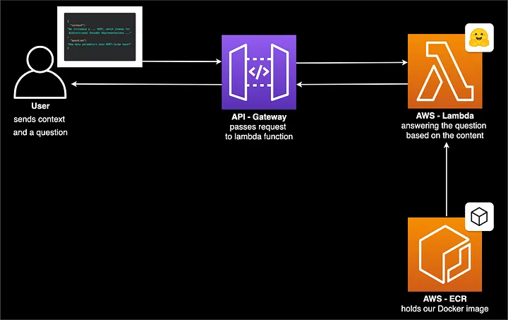

# distilbert-service
This repo takes a Distilbert model from Huggingface and deploys it as an API endpoint using AWS Lambda, ECR,  API gateway, and CDK. This is meant to act as a template that can used to easily deploy custom models in real time. 

Its better to prefer Lambda rather than hosting the model in an EC2 instance. The cost of hosting model via Lambda is very low and hence is ideal for a hobby project. we are only charged based on invocation. For the free tier, AWS provides a million invocations free per month which is more than enough. Also AWS Lambda can support containers upto 10 GB.

Here is the   


## 1. setup environment
Assuming you have the python environment installed, create a virtual env (for eg using conda) and then install
`pip install -r lambda/requirements.txt`

Have AWS CLI installed and configured. Also have Docker installed and running. 

## 2. Building custom model

Run `lambda/create_custom_model.py` to build a custom model. You can add your own datasets and train a model. In the end, save the tokenizer and the model used. 

we will directly load these into the docler image. Another way to load a model is directly from huggingface or have files read from s3. For now, to keep things simple we just load them in the container itself.

## 3. Creating Lambda handler
This is the function that will execute when the lambda function is called. The lambda function will take in an input text and return a response that contains the predictions. 
Checkout `lambda/handler.py`. The entrypoint is mentioned in the Dockerfile. 

## 4. Building and running docker image locally
This step is optional but highly recommended. Here we will build a docker image locally and test it to make sure if its working as expected. 

Run following commands  - 

`cd lambda`

Build Docker image
`docker build -t sentiment-analyzer:latest .`

Run the docker image
`docker run -p 8080:8080 sentiment-analyzer:latest`

curl request to test docker container from CMD
```
curl --request POST \
  --url http://localhost:8080/2015-03-31/functions/function/invocations \
  --header 'Content-Type: application/json' \
  --data '{"body":"{\"context\":\"some context\",\n\"text\":\"this movie is so good\"\n}"}'
```

You should see an output that returns that predictions for the text in above curl command. In case of any issues, check for the error message in the response.

## 5. (optional) Manually push the docker images to AWS and configure AWS Lambda, endpoint, etc. 
 
 Again doing this manually once will give you an idea of the setup workflow. Although we can do this automatically using AWS CDK which is the next step. 

Tag docker image
`docker tag sentiment-analyzer <aws_account_id>.dkr.ecr.<aws-region>.amazonaws.com/sentiment_analyzer_v1`


connect docker with ECR. Remove the profile flag if using default aws account
`aws ecr get-login-password --region us-west-2 --profile <aws_profile> | docker login --username AWS --password-stdin <aws_account_id>.dkr.ecr.<aws-region>.amazonaws.com`

create a repo in ECR before pushing the image  
`aws ecr create-repository --repository-name sentiment_analyzer_v1 > /dev/null`

push image to ECR  
`docker push 153853921630.dkr.ecr.us-west-2.amazonaws.com/sentiment_analyzer_v1`

Go to AWS ECR adn verify that you can see this image. 

once you have this go to AWS Lambda console and create a lambda function using container image and select the above `sentiment_analyzer_v1` image using "browse images". select the relevant architecture that the docker image was built on (i faced problems initially by selecting wrong architecture)

once you create a function, add the trigger as API gateway. This will create an API endpoint for you. Be sure to set a high timeout like 60 seconds for the API. 

Test this using `lambda/test_api_endpoint.py`. Initially this might take longer since the container has to start but subsequent API requests are faster. 

## 6. Deploy API endpoint using CDK

All the steps mentioned in 5, can be acheived programmatically using AWS CDK. This deploys all the resources required. 

Install AWS CDK and have the required libraries installed. You will need to install nvm and npm for this. 
check the file `cdk/cdk-stack.ts` for the packages to be installed using `npm install`. use the latest node version. 

Run `cdk bootstrap` and `cdk deploy` to deploy the resources. 

This should print the API endpoint. You can also refer to AWS console to find the endpoint. 

Test this using `lambda/test_api_endpoint.py`. Initially this might take longer since the container has to start but subsequent API requests are faster. 

## References

1. https://towardsdatascience.com/serverless-bert-with-huggingface-aws-lambda-and-docker-4a0214c77a6f
2. https://medium.com/@mgsudhanva/deploying-hugging-face-transformers-model-on-aws-lambda-with-docker-containers-84c6f4483f2a 


